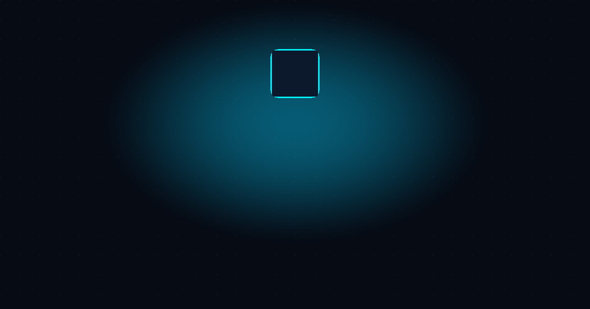

# 🖥️ XIVIZLEY — Visual Homelab & Docker Compose Architect

<div align="center">



### **Görsel Homelab & Docker Mimari Tasarım ve Dağıtım Platformu**
**Visual Homelab & Docker Compose Architecture Infrastructure Suite**

[](https://nextjs.org/)
[](https://react.dev/)
[](https://www.typescriptlang.org/)
[](https://tailwindcss.com/)
[](LICENSE)

[🌐 Canlı Kullan (xivizley.com.tr)](https://xivizley.com.tr) • [🎬 YouTube Videosu](https://www.youtube.com/watch?v=Ib8iss9eSEI) • [📚 Kullanım Rehberi](https://xivizley.com.tr/guide) • [✨ Hazır Şablonlar](https://xivizley.com.tr/templates)

</div>

---

## 💡 XIVIZLEY Nedir? / What is XIVIZLEY?

**XIVIZLEY**, Linux VDS/VPS ve ev sunucularınız (Homelab) için **115 Docker servisini ve 31 hazır şablonu** görsel olarak tasarlamanızı, port çakışmalarını canlı tespit etmenizi ve tek bir SSH komutuyla sunucunuza dağıtmanızı sağlayan görsel mimari tasarım aracıdır. **Core is open source (MIT).**

Karmaşık `docker-compose.yml` dosyaları, çakışan portlar (örn. AdGuard vs Pi-hole port 53, Nginx vs Caddy port 80) ve terminal parametreleriyle vakit kaybetmek yerine; servisleri tuval üzerinde bağlayın, port çakışma giderici ile optimize edin ve üretime hazır Compose mimarinizi oluşturun.

---

## 📦 Açık Kaynak Mimarisi & Kapsam (Open Source Scope)

- **Açık Kaynak Çekirdek (Core - MIT Lisansı):**
  - Görsel sürükle-bırak tasarım tuvali (React Flow).
  - 115 adet Docker servis modülü ve 31 adet küratörlü hazır mimari şablonu.
  - Deterministik port çakışma tespit ve otomatik alternatif port öneri motoru.
  - DIN 40719 endüstriyel teknik şartname ve PDF pafta üretimi.
  - Temiz Docker Compose YAML ve yerel `deploy.sh` script üreticisi.
- **Kapalı / Barındırılan Altyapı (Private Infrastructure):**
  - Çok kullanıcılı bulut hesap oturumu ve uzaktan telemetri servisleri.
  - Kurumsal e-posta iletim (SMTP) ve Telegram bildirim altyapısı.

---

## 🔒 Güvenlik Yaklaşımı ve Doğrulama (Security Scope)

Güvenlik iddialarında abartı yerine somut teknik tedbirlere dayanıyoruz:
- **Katalog Doğrulaması (Whitelisting):** Paylaşılan tasarım URL'leri üzerinden üretilen betiklerde yalnızca yerleşik katalogda (`MODULE_CATALOG`) tanımlı imajlar ve onaylı portlar kabul edilir. URL parametrelerinden `privileged: true`, `network_mode: host`, keyfi `command`/`entrypoint` veya tehlikeli mount'lar (`/var/run/docker.sock`, `/:/host`) üretilemez.
- **Shell & YAML Kaçışları (Escaping):** Betik üretiminde kullanıcı girdileri katı tırnaklama (`JSON.stringify` ve `printf %q`) kurallarıyla işlenir; rastgele sınır belirteçli (collision-resistant) here-doc yapıları kullanılır.
- **Ön Denetim & Kuru Çalıştırma (Pre-flight & Dry-Run):** Üretilen dağıtım betiği `--check` bayrağı ile sistemde değişiklik yapmadan port durumunu ve gereksinimleri denetleyebilir.

---

## ✨ Öne Çıkan Özellikler / Key Features

### 🎨 1. Görsel Sürükle-Bırak Tuval & Otomatik Düzen (ReactFlow)
- **115 Popüler Docker Modülü:** Ağ, güvenlik, medya, yapay zeka, veri ve oyun sunucusu modüllerini tuvale sürükleyin.
- **Akıllı Otomatik Hizalama (Auto-Layout):** Modülleri katmanlı mimari düzenine (İşletim Sistemi ➔ Proxy ➔ Uygulamalar ➔ Veritabanları) tek tıkla hizalayın.
- **Renk Kodlu Kategoriler:** Her konteyner kategorisi özel teknik renk kodları ve standart ikonlarla görselleştirilir.

### 🛡️ 2. Canlı Port Çakışması Motoru & AI Doktor (Conflict Engine)
- **Anlık Port Çakışma Tespiti:** Çakışan host portlarını (örn: 80, 443, 8080, 3000, 53) anında kırmızı olarak vurgular.
- **Akıllı Alternatif Port Önerisi (`PORT_ALTERNATIVES`):** Kullanıştaki moda göre çakışan portlara otomatik alternatif port atar.
- **🩺 AI Doktor (`AIDoctorModal`):** Eksik veritabanı bağımlılıklarını (örn: Umami veya Penpot için PostgreSQL) ve port çakışmalarını tespit edip düzeltir.

### ⚡ 3. 31 Adet Hazır Mimari Şablonu (Curated Stacks)
- Supabase, RustDesk, SearXNG, Pterodactyl, Nextcloud, Immich, Minecraft PaperMC ve medya otomasyonu dahil 31 üretime hazır stack.
- **Arama & Kategori Filtreli Modal (`QuickStackPacksModal`):** `Tümü`, `Medya`, `Güvenlik`, `AI & Otomasyon`, `Web & Veri`, `Ofis & Araçlar`, `Oyun` filtreleri.
- **Paket Vitrini:** 
  1. 🎬 **4K Medya & Sinema Paketi:** Jellyfin + qBittorrent + Radarr + Sonarr + FileBrowser
  2. 📚 **Manga, Kitap & Medya Kütüphanesi:** Kavita + Audiobookshelf + FileBrowser + Caddy
  3. 🛡️ **Siber Güvenlik & VPN Kalkanı:** WireGuard + Pi-hole + AdGuard Home + Nginx Proxy Manager
  4. 🤖 **Yerel Yapay Zeka & LLM Stüdyosu:** Ollama + Open-WebUI + Flowise + Nginx
  5. 📈 **Web Analitik & Veri Merkezi:** Umami Analytics + PostgreSQL + NocoDB + Caddy
  6. 🎯 **Otonom Fiyat & Sistem Radarı:** Changedetection.io + Uptime Kuma + n8n + Nginx
  7. 🎨 **Açık Kaynak UI/UX Tasarım Stüdyosu:** Penpot + PostgreSQL + Redis + Caddy
  8. ☁️ **Özel Bulut & Ofis Depolama:** Nextcloud 28 + Collabora Office + PostgreSQL + Redis
  9. 🏠 **CasaOS Başlangıç Homelab:** CasaOS + Docker Engine + FileBrowser + Jellyfin
  10. 🏡 **Akıllı Ev & IoT Karargahı:** Home Assistant + Mosquitto MQTT + Node-RED
  11. 🎮 **Minecraft PaperMC 1.21.4:** PaperMC + ViaVersion + AuthMe + EssentialsX
  12. 📄 **Paperless Dijital Belge Arşivi:** Paperless-ngx + PostgreSQL + Redis + Tika OCR

### 📸 4. 9:16 Instagram Story Homelab Kimlik Kartı Generator (`StoryCardModal`)
- **Sosyal Medya Hazır Görsel Üretici:** Homelab mimarinizi 9:16 dikey Instagram/TikTok Story kartı olarak dışa aktarın.
- **Tema Seçenekleri:** Aurora Night, Cyberpunk Neon, Emerald Matrix, Deep Space, Sunset Gold.
- **Canlı Metrikler:** Güvenlik skoru, RAM/CPU donanım gereksinimi ve servis ikon rozetleri.

### 🤖 5. Doğal Dille AI Mimari Üretici (`AIGeneratorModal`)
- **İstemi Mimariye Dönüştürme:** *"AdGuard Home engelleyicili, Plex medya sunuculu ve WireGuard VPN'li güvenli bir sunucu tasarla"* yazın, AI düğümleri oluşturup kabloları otomatik bağlasın.

### 🚀 6. Dağıtım, Dışa Aktarma & Paylaşım
- **Tek Satır SSH Kurulumu (`curl | bash`):** Üretilen `deploy.sh` scriptini doğrudan sunucunuzda çalıştırın.
- **Tam Proje ZIP İndirme:** `docker-compose.yml`, `.env` ve `deploy.sh` dosyalarını tek arşivde indirin.
- **PNG & SVG Dışa Aktarma:** Mimarinin yüksek çözünürlüklü görsel veya vektör çıktısını alın.
- **JSON & URL ile Paylaşım:** Mimarileri base64 URL parametresi veya JSON kopyalayarak arkadaşlarınızla paylaşın.

---

## 🛠️ Desteklenen Servis Kataloğu (115 Modül & 31 Şablon)

| Kategori | Modüller / Servisler |
| :--- | :--- |
| **İşletim Sistemi & Platform** | Ubuntu 22.04 LTS, Debian, Docker Engine, Portainer, CasaOS |
| **Yapay Zeka & LLM** | Ollama AI, Open-WebUI, Flowise AI, LocalAI |
| **Web Analitik & NoCode** | **Umami Analytics** *(Yeni)*, **NocoDB** *(Yeni)*, Baserow, Ghost CMS, WordPress, Strapi |
| **Tasarım & Ofis** | **Penpot UI/UX** *(Yeni)*, Nextcloud 28, Collabora Office, Paperless-ngx, Vaultwarden, Mealie |
| **Medya & Kütüphane** | **Kavita Manga Reader** *(Yeni)*, Plex Media Server, Jellyfin 4K, Audiobookshelf, Immich, Calibre-Web |
| **Otomasyon & İndirme** | Radarr, Sonarr, Overseerr, qBittorrent, Transmission |
| **Ağ & Siber Güvenlik** | AdGuard Home, Pi-hole, WireGuard, Tailscale, Cloudflare Tunnel, Authentik SSO, CrowdSec |
| **Ters Vekil (Reverse Proxy)** | Nginx Proxy Manager, Traefik, Caddy |
| **İzleme & Takip** | **Changedetection.io** *(Yeni)*, Uptime Kuma, Glances, Heimdall, Netdata, Prometheus, Grafana |
| **Oyun Sunucuları & Eklentiler** | Minecraft PaperMC 1.21.4 (ViaVersion, AuthMe, EssentialsX, LuckPerms vb.), FiveM, Palworld, CS2, RomM Retro Arcade |

---

## 🚀 Yerel Geliştirme Kurulumu / Getting Started

```bash
# 1. Depoyu klonlayın
git clone https://github.com/Xivizley/xivizley.git
cd xivizley

# 2. Bağımlılıkları yükleyin
npm install

# 3. Geliştirici sunucusunu başlatın
npm run dev
```

Tarayıcınızda [http://localhost:3000](http://localhost:3000) adresine giderek XIVIZLEY mimarını kullanabilirsiniz!

### Üretim Derlemesi (Production Build)
```bash
npm run build
npm start
```

### ⚙️ Ortam Değişkenleri & Form Koruması (.env)
Projeyi kendi sunucunuzda derleyip çalıştırmak için `.env.example` dosyasını `.env.local` olarak kopyalayabilirsiniz:
- **Geliştirici Ortamı (`npm run dev`):** Temel tuval, modül oluşturucu, port radarı ve YAML çıktıları doğrudan çalışır. Turnstile anahtarları girilmemişse test amaçlı atlanır.
- **Üretim Ortamı (`production`):** İletişim, bülten aboneliği ve mimariyi e-postaya gönderme formları bot ve spam saldırılarına karşı hız sınırlamalı ve **Cloudflare Turnstile** korumalıdır. Canlı üretim ortamında bu üç formun yanıt verebilmesi için ücretsiz bir Cloudflare Turnstile anahtar çifti (`NEXT_PUBLIC_CLOUDFLARE_TURNSTILE_SITE_KEY` ve `CLOUDFLARE_TURNSTILE_SECRET_KEY`) `.env.local` içine tanımlanmalıdır; tanımlanmadığı takdirde üretim ortamında form uç noktaları güvenlik gereği 503 döner.

---

## 🔒 Mimari, Veri Güvenliği ve Şeffaflık (Architecture & Privacy Disclosure)

XIVIZLEY, gizlilik ve şeffaflığı temel alan bir mimariye sahiptir:
- **İstemci Taraflı Tuval (Client-Side Canvas):** Tasarladığınız mimari tuvali, düğüm bağlantıları ve YAML önizlemesi doğrudan tarayıcınızın yerel belleğinde (`localStorage` / React state) çalışır.
- **Tek Tıkla Dağıtım Betiği (`GET /api/run/raw`):** Tek satırlık SSH kurulum komutu (`curl -sSL .../api/run/raw?data=... | bash`), tuvaldeki konfigürasyon parametrelerini şifrelenmiş/base64 formatta uç noktaya göndererek güvenli bir `deploy.sh` üretir. Bu uç nokta **durumsuz (stateless)** çalışır; uygulama kodu kullanıcı verisini veya mimari yapılandırmalarını veritabanına yazmaz. (Altyapı düzeyinde barındırma sağlayıcısının ve CDN'in standart web sunucusu erişim logları hariçtir.)
- **Katalog Doğrulaması & Güvenlik:** Üretilen `docker-compose.yml` çıktıları, yalnızca onaylı modül kataloğundaki (`MODULE_CATALOG`) sabit imaj ve parametreleri kabul eder. Katalog dışı rastgele imajlar, `privileged: true`, yetkisiz `docker.sock` bağlamaları veya tehlikeli capability bayrakları sunucu tarafında reddedilir ve otomatik güvenlik testleriyle doğrulanır.
- **Ağ Radarı & Telemetri:** Dağıtım öncesi sunucu gecikme ve port kontrolleri (`/api/pulse/telemetry`), yalnızca istemcinin talep ettiği bağlantı testini gerçekleştirir; uygulama kodu kişisel kullanıcı profili oluşturmaz veya veritabanında saklamaz.

---

## 🤝 Resmi Sponsorlarımız & İş Ortaklarımız

- ⚡ **[OWEB (TR Cloud)](https://www.oweb.net.tr/tr-cloud-sunucu.php):** 10 Gbit/s port hızı ve TR Cloud Datacenter serisi NVMe VDS altyapı sponsoru (Affiliate Ref: `aff=975`).
- 🚀 **[Hosting.com.tr](https://www.hosting.com.tr):** Kurumsal bulut ve VDS Ultra serisi altyapı partneri (Affiliate Ref: `aff=1702`).

---

## 📄 Lisans / License

Bu proje **MIT Lisansı** ile lisanslanmıştır. Ayrıntılar için [LICENSE](LICENSE) dosyasına göz atabilirsiniz.

<div align="center">
  <sub>Made with ❤️ by <a href="https://github.com/Xivizley">Alperen</a> and the XIVIZLEY Community.</sub>
</div>
